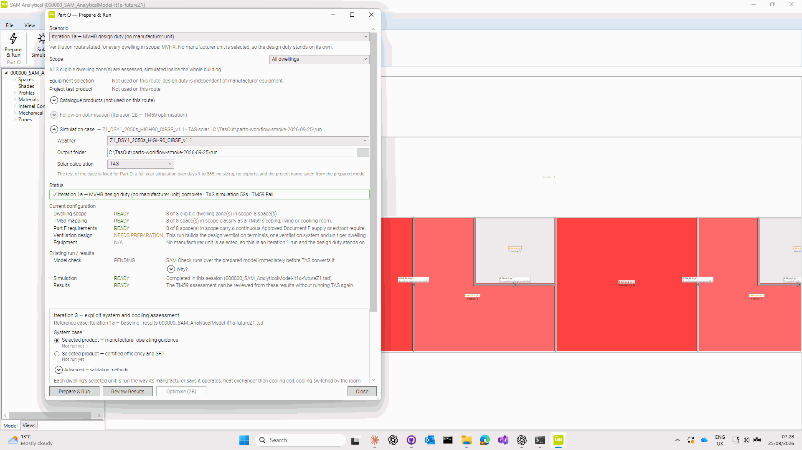
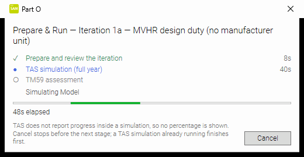
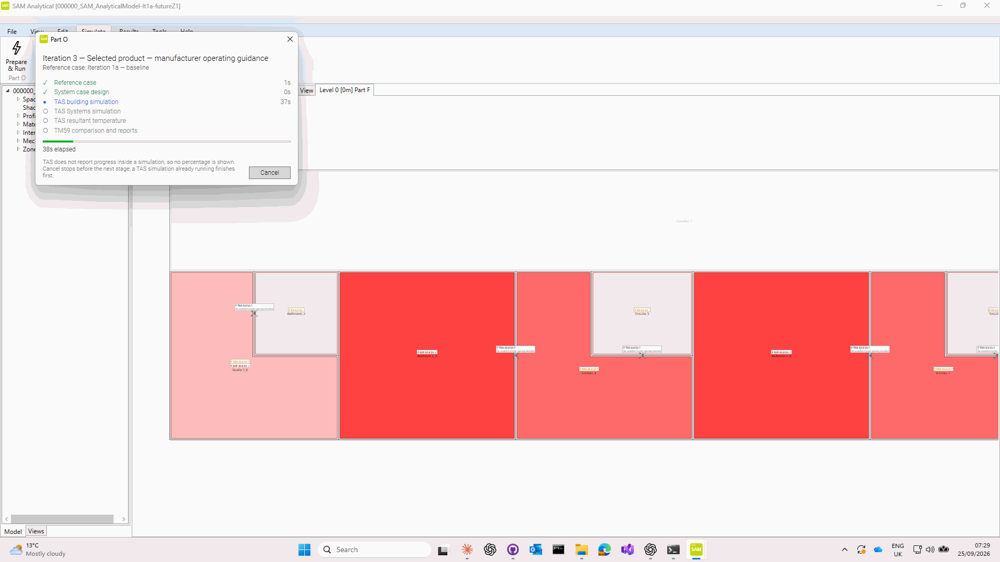
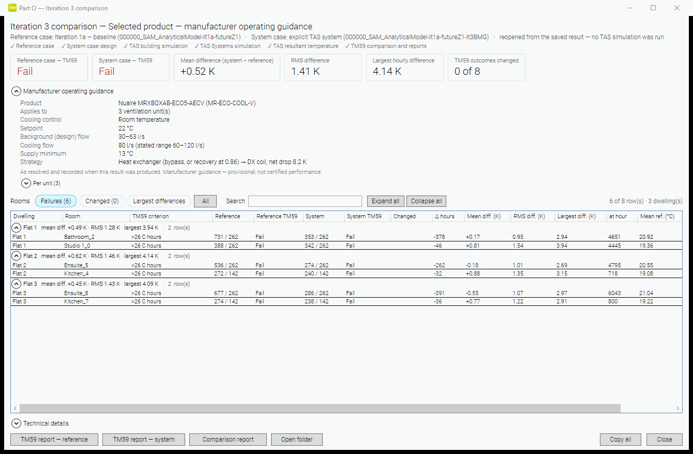
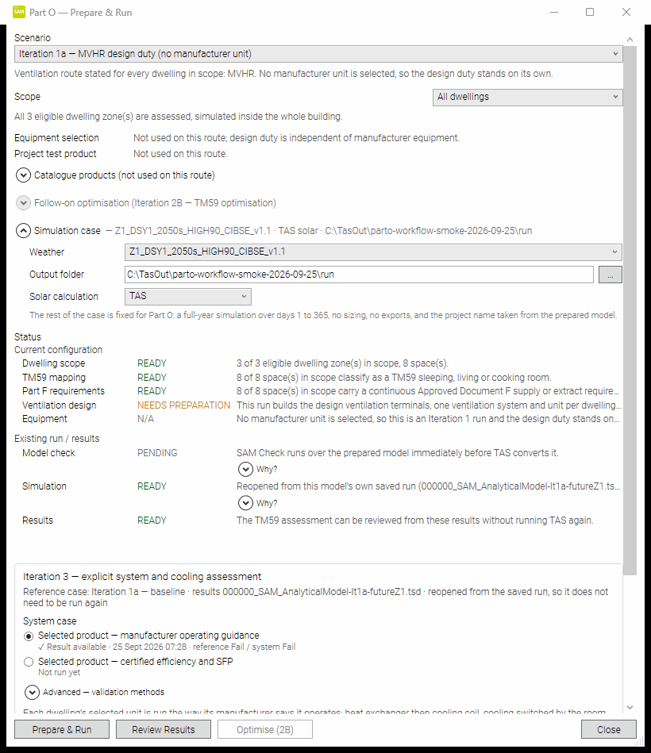
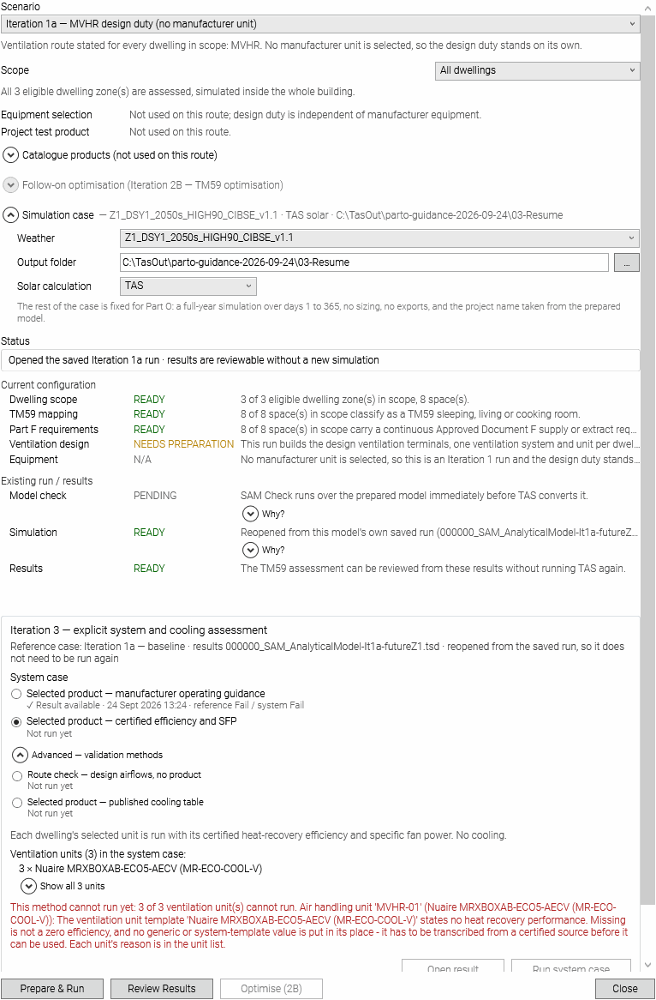

# Part O workflow simplification - live smoke tests (25 Sep 2026)

Real `SAM Analytical.exe` from `SAM_UI\build` (branch `feature/parto-workflow-simplification-2026-09-24`), real TAS,
driven through UI Automation. Model `SAM_zoningAM-CIBSEfutureZ1.sam` (sha `a7e09a25`, the Nuaire acceptance
model; DSY1 2050s weather). Evidence and scripts outside git: `C:\TasOut\parto-workflow-smoke-2026-09-25\`.

## 1. Prepare & Run (Iteration 1a)

- Hub: Simulation case in the Hub (weather `Z1_DSY1_2050s_HIGH90_CIBSE_v1.1`, output folder, TAS solar); Run enabled.
- Review iteration opened (the one genuine decision); the progress window stood aside for it.
- No Simulate dialog. No message box of any kind (0 in every pass).
- One progress window for the whole TAS run (window watcher: visible 07:43:26 -> 07:44:22, the whole 54 s run,
  hidden only when the TM59 report opened). Its own pixels mid-run: stages with durations, the TAS step
  ("Simulating Model"), elapsed time, Cancel - see `02-progress-prepare-and-run.png`.
- TM59 report opened (8 assessed, Fail); back in the Hub the inline line read
  "✓ Iteration 1a ... complete · TAS simulation 53s · TM59 Fail".
- Repeated four more times in separate folders (run2-run5): same outcome, 50-54 s TAS, 0 message boxes.

## 2. Iteration 3 - Selected product - manufacturer operating guidance

- Hub after the run: "Reference case: Iteration 1a — baseline"; guidance method selected by default; pre-flight
  "Ventilation units (3): 3 × Nuaire MRXBOXAB-ECO5-AECV (MR-ECO-COOL-V)"; Run system case enabled. No method popup.
- Run: 6.7 min. Progress window present in 124 of 126 polls (about every 3 s) and its content changed on every one; moved,
  minimised and restored mid-run without effect on the run. Stages as recorded:
  reference 1 s · design 0 s · TAS building 41 s · TAS Systems 4m 43s · TAS resultant 1m 12s · TM59/reports 1 s.
- "Iteration 3 comparison" opened: reference Fail / system Fail, mean diff. +0.52 K, RMS 1.41 K, largest 4.14 K,
  0 of 8 outcomes changed; guidance card with the recorded values (22 °C room-temperature control, 80 l/s cooling
  flow, 13 °C minimum, exchanger -> DX). Resized small/large; closed; Hub line
  "✓ Iteration 3 complete · ... · 6m 38s · reference Fail / system Fail", status "✓ Result available".
- Open result in the same session: 12 s, no TAS. In a fresh process (File > Open of the run model): Hub showed the
  reopened reference and "✓ Result available"; Open result in 14.7 s with only the TSD results reader running (no
  TBD/TPD); Review Results (TM59) opened; 0 message boxes; no windows left behind after closing the Hub.
- Only the guidance method was run; the other methods stayed "Not run yet" (independent per-method storage).

## Notes

- The session locked part-way through; later images are the windows' own pixels (PrintWindow), not the screen.
- UI Automation exposes no elements for the progress window after it re-shows (pixels are correct); an
  accessibility follow-up, not a user-visible defect.
- A pre-existing "Reloading" indicator flashes (~0.5 s) when the model is adopted; unchanged by this work.

| | |
|---|---|
|  |  |
|  |  |
|  |  |
