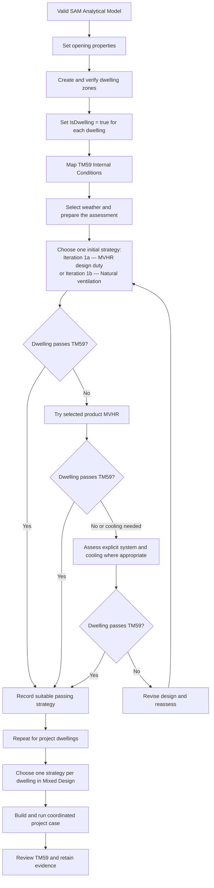
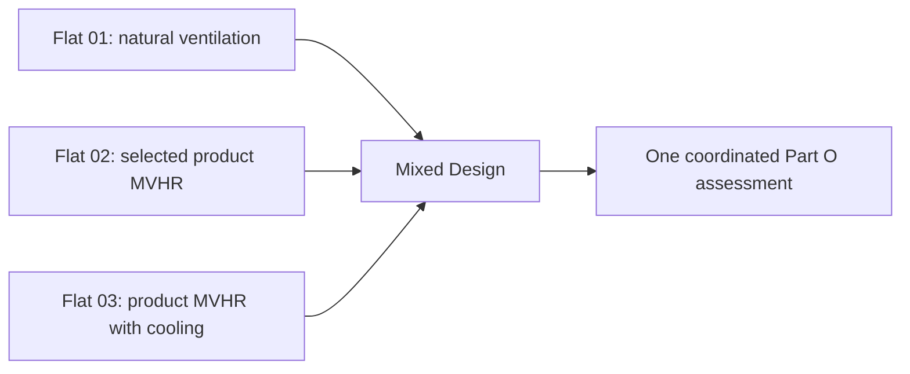

<!-- SPDX-License-Identifier: LGPL-3.0-or-later -->
<!-- Copyright (c) 2020-2026 Michal Dengusiak & Jakub Ziolkowski and contributors -->

# Part O — Prepare & Run

Start with a sound SAM Analytical Model, test suitable ventilation strategies, then build and assess one coordinated design for the project. This guide covers the SAM_UI desktop workflow. Apply the Approved Document O and CIBSE TM59 methodology required by your project.

## Part O workflow at a glance

**How to read this workflow:** Prepare the analytical model first. Keep a suitable passing strategy for each dwelling and progress only where needed. Mixed Design combines your dwelling selections into the final coordinated project assessment.

# Part 1 — Prepare

## 1. Start with a valid SAM Analytical Model

Check geometry, spaces, analytical adjacency, constructions, openings and room names or groupings. Resolve model errors before Part O; the assessment cannot repair an invalid analytical model. Keep a clean **design model** as the source for later cases. Saved prepared and result models are evidence of a run, not a new design baseline.

## 2. Assign opening properties

Select the relevant apertures in the analytical model, right-click and choose **Opening Properties**. In the aperture editor, enable **Opening Properties** and review **Discharge Coefficient**, **Function** and **Description** for each opening used by the ventilation strategy. Check that the intended openings, constructions and operability match the design; a geometrical window alone does not establish its ventilation behaviour. Save the design model.

## 3. Create and verify dwelling zones

Select the rooms of a dwelling, right-click and choose **Manage Zones**. Create or edit a zone that groups those rooms; repeat for each flat or house. Check the zone name, category and room membership. Keep shared corridors and other common spaces out of dwelling zones unless the assessment calls for them. A room assigned to the wrong dwelling changes the scope and can give the wrong assessment.

## 4. Mark the dwellings

In the **Zone** editor, set **Dwelling** to **Yes** for each dwelling zone (the saved `IsDwelling = true` property). Use **No** for a zone explicitly outside dwelling scope. **Not set** is a separate legacy state; do not rely on it when preparing an explicit project assessment. Save, then check that **Prepare & Run** lists the expected dwellings.

## 5. Map TM59 Internal Conditions

Use **Edit → Analytical Model → Map IC (TM59)** after grouping the dwellings. Review the proposed room mapping in the **TM59 - Map Internal Conditions** window and assign it. Verify that the dwelling's living, sleeping and cooking rooms have suitable internal conditions and TM59 classification. Check occupancy and room naming before running: missing internal conditions can block the run or prevent a complete TM59 assessment, while a misclassified room may receive the wrong criterion. Resolve every in-scope room's assignment and confirm the **Readiness** summary in Prepare & Run.

## 6. Weather

Part O simulations require weather data appropriate to the project assessment methodology. For UK projects this will normally be a **DSY weather file**; the selector also accepts supported weather data in other formats. Select the required dataset under **Simulation case → Weather** and check its location and scenario. SAM runs the Part O case as a full-year simulation.

Before issuing results, verify that the intended weather was used and that the completed evidence corresponds to that case. The completed Iteration 3 evidence records the weather identity and calculated dry-bulb peak for checking and reproduction.

## 7. Prepare the assessment

Open **Simulate → Part O → Prepare & Run** on the clean design model. Choose **Scope**: **All dwellings**, **Selected dwellings**, or **Selected dwellings in isolation**. Selected dwellings normally remain in the whole-building thermal model; choose isolation only when that separate thermal scope fits the assessment plan.

Under **Simulation case**, set **Weather**, **Solar calculation** and a fresh **Output folder** root. The Part O case is a full-year simulation. Read **Readiness**, expand **Show details** for blockers, and resolve them before starting TAS. Check Part F design duties and products where relevant.

Leave **Direct T3D** unchecked for the established gbXML route. Check it to build the TAS3D model directly from the SAM geometry; this applies to the TAS solar calculation only, and the collapsed **Simulation case** header states the route in use. The choice is not remembered between separate openings of the command, so check it each time you need it.

> **IMPORTANT:** A fresh output root is the simplest choice for each new run. If you press **Prepare & Run** with a case folder that already holds results from an earlier session, SAM asks first, **before** the Review window: **Part O — Replace existing results** names the case and folder and says how many generated files it holds and when they were last written. **Cancel** (the default) changes nothing. **Replace existing results** removes only that case's `tas`, `reports` and `diagnostics` folders and its `PartOCase.json` marker, and only when TAS is about to start, so cancelling the Review afterwards still leaves every file as it was. Other files in the folder, other iterations' folders and your design model are never touched. If a file is in use, SAM says it could not be removed and runs nothing. A retry of the same run and case may reuse its folder. Keep the result model with its associated output tree.

# Part 2 — Test and escalate

## 8. Choose the simplest suitable strategy

The iterations are an engineering decision ladder, not a sequence every dwelling must complete. Start with a strategy allowed by the project. If the dwelling passes TM59, retain it as a candidate. If it fails, review the failing rooms and progress only as far as needed.

| Assessment | Engineering question |
| --- | --- |
| **Iteration 1b — Natural ventilation (no mechanical system)** | Can natural ventilation meet the dwelling's assessment? |
| **Iteration 1a — MVHR design duty (no manufacturer unit)** | Can MVHR at the required design duty meet it without selecting a product? |
| **Iteration 2 — MVHR with manufacturer unit** | Does the selected product meet the design duty and TM59 assessment? |
| **Iteration 3 — Explicit system and cooling assessment** | Where appropriate, does the supported explicit TAS Mechanical System and cooling behaviour achieve the intended outcome? |
| **Mixed Design** | Which dwelling-specific strategies should form the coordinated project case? |

**Iteration 2B — TM59 optimisation** is an optional follow-on to a completed Iteration 2 result. It raises design airflow within the selected unit's capacity and reruns the assessment; it is not a starting scenario.

## 9. Run Iteration 1a or 1b

In **Scenario**, choose **Iteration 1b — Natural ventilation (no mechanical system)** when the project permits a natural route and the model's openings support it. Choose **Iteration 1a — MVHR design duty (no manufacturer unit)** for the mechanical design-duty route. These are alternatives; their numeric order is not a rule to run both. Check the dwelling scope, openings or MVHR duty, weather and readiness.

Click **Prepare & Run**. In **Part O — Review iteration**, inspect the preparation and choose **Accept & Run TAS** or **Cancel**. The progress window tracks the native TAS run and TM59 assessment. A completed run does not stop on a message box: any notes are kept on the Hub line (for example "2 notes - see Show details"). A run that did not complete still shows why it stopped. On completion use **Review Results**. Record the dwelling's pass/fail outcome and any failing room criteria; a pass is a candidate for Mixed Design.

## 10. Assess the result before escalating

Review each assessed room's TM59 result, actual value and limit. A dwelling may pass one route and fail another. Record the strategy, weather and scope used for each conclusion. Where a dwelling fails, check whether the model inputs and operating assumptions are sound before selecting a more involved strategy. Common spaces may need separate review; they are not automatically part of a dwelling's Iteration 1a or 1b result.

## 11. Iteration 2 — selected product

Choose **Iteration 2 — MVHR with manufacturer unit** in **Prepare & Run**. Review **Equipment selection**, its product pool and dwelling assignments. The selected unit's available airflow limits what it can deliver; its capacity does not replace the design ventilation duty. Confirm the intended manufacturer/product, unit-to-dwelling assignment, design airflow, scope and weather. Run and review TM59 as above.

If a dwelling passes, its product-based route can inform Mixed Design. If airflow is insufficient, check the design and product choice. Where appropriate, **Optimise (2B)** can test increased design airflow within the same product's capacity. Do not assume a product pass is an explicit cooling-system pass.

## 12. Iteration 3 — explicit system and cooling

After an eligible full-year **Iteration 1a** or **Iteration 2** run, the **Iteration 3 — Explicit system and cooling assessment** panel becomes available. For the current product operating and cooling route, use an Iteration 2 product result and select **Selected product — manufacturer operating guidance** under **System case**. Iteration 1b cannot provide this mechanical reference. Review the unit summary and preflight message before **Run Iteration 3**.

For every cooled dwelling, first select its control room on the clean design model: open **Simulate → Part O → Mixed Design**, set its MVHR/product strategy, select the dwelling, choose **Cooling on**, select **Cooling control room**, click **Confirm control room**, then **Save selection** and save the model. The room must belong to that dwelling and be served by its unit. SAM does not choose a control room for you. Prepare the Iteration 2 reference from this saved design. The current nominal Nuaire control uses **22°C**.

If a step is missing, the Iteration 3 panel does not just refuse: it lists the steps as a checklist (done, current, later) with a button on the current one - **Remove Results...** where the open model still carries results, or **Choose cooling control rooms (Mixed Design)...**, which opens Mixed Design and returns you to the Hub. After saving rooms, run **Prepare & Run** for Iteration 2 again, because Iteration 3 reads the cooling rooms from the prepared design. Where no product method can run yet, the Hub may select **Route check** (under Advanced) for you and say so; a method you chose yourself is never replaced. The **Iteration 3** button in the actions row scrolls the panel into view.

Iteration 3 represents supported behaviour with TAS Mechanical Systems, including airflow, heat recovery or bypass and active supply-air cooling. After running, use **Open result** to review **Part O — Iteration 3 comparison**, the reference and system TM59 reports, and operating diagnostics. Check that the unit operated as intended as well as whether the dwelling passed. Iteration 3 is needed only where that system/cooling representation answers the design question.

# Part 3 — Coordinate

## 13. Determine each dwelling's suitable passing design

Compare the assessments for each dwelling. Choose the least involved **appropriate** passing strategy under the project constraints, and retain the result that supports it. Engineering constraints may rule out a numerically passing option. If no suitable option passes, revise the design and reassess; do not treat a failed dwelling as resolved.

## 14. Build the Mixed Design selection

A project can use different strategies for different dwellings. **Simulate → Part O → Mixed Design** works from the clean design model and gives each dwelling one selected ventilation strategy; **Active cooling** is a separate on/off choice for an MVHR dwelling. Its selected-design column shows the proposed design. The illustration below maps investigation outcomes to actual Mixed Design choices rather than implying an “Iteration 3” button.

| Dwelling | Supporting assessment | Mixed Design selection |
| --- | --- | --- |
| Flat 01 | Iteration 1b passes | **Natural ventilation** |
| Flat 02 | Iteration 2 passes | **MVHR** with the selected product; **Cooling off** |
| Flat 03 | Product and cooling assessment passes | **MVHR** with the selected product; **Cooling on** and a confirmed control room |

Use **Screen strategies…** if you need optional screening evidence. It currently screens natural ventilation, MVHR baseline and selected-product MVHR; optimised and cooling strategies are not screening runs. **Select MVHR products from the ventilation unit catalogue** applies to the whole Mixed Design run. If it is enabled for product or cooled dwellings, an Iteration 1a generic MVHR pass alone does not establish that another MVHR dwelling will pass the final product-based case; assess that dwelling with a product before selecting it. Suggestions do not change the selected design until you apply them. Set the project constraints and product pool, select the intended strategy for each dwelling, and use **Save selection**; save the model to retain it.

## 15. Run the coordinated project case

Set the Mixed Design **Simulation case** and fresh output root. Use **Check design** to find refusals before simulation. For cooled dwellings, confirm the product supports cooling, its airflow is within the permitted range, and **Cooling control room** is populated. Click **Build & Run Mixed Design**. This builds one coordinated model from the clean baseline and runs the full-year assessment. Review the final coordinated Part O result; individual screening or iteration passes do not replace it.

## 16. Review and retain the final result

Review the **Final TM59** and **Failing spaces / note** columns and open **Open final TM59 result…**. Check every dwelling, failing criteria and any separately relevant common spaces. Retain the saved result model, reports and complete output tree together with the design decisions, weather identity and selected product information.

# Supporting information

## Reopen, resume and protect evidence

**Prepare & Run** refuses a prepared or simulated result as a new design baseline. Reopen the original clean design. If necessary, use **Results → Part O → Remove Results...** and **Save cleaned copy...**, inspect its baseline check, then **Open cleaned copy**. The original result and TAS files remain available.

If a run is cancelled after TAS stages complete, retry the same run and case in the session. SAM may reuse completed stages and report **“Reusing the completed TAS results”**. Changed design, weather or case identity can prevent reuse.

### Reviewing a completed run later

To review a completed run without simulating again, open its **result model**, then **Simulate → Part O → Prepare & Run**:

- Open `<output folder>\<case>\tas\<name>.sam` - for example `Iteration1a\tas\000000_SAM_AnalyticalModel.sam`. This file carries the run record and the link to the design it came from.
- Do **not** open `<name>.prepared.sam` (saved before simulating, with no run record), the `.partorun.json` note, or your original design model. Opening the design starts a new session with no run attached, so Part O asks you to simulate.
- Keep the `.sam`, the `.tsd` results file and the rest of the `tas` folder together and unchanged. The result is accepted only when the results file still has the length and write time it was saved with and the model still matches its record. Re-simulating the case, or overwriting or editing any of these, means you are asked to simulate again.

When it works, the Hub reads "Saved Iteration N results reopened - ready to review". **Review Results** opens TM59 without a new simulation, and **Open result** reopens an existing Iteration 3 comparison. Limits of a reopened run: it is for review, not a new baseline, so **Prepare & Run** is disabled for it (start new cases from the design model); **Optimise (2B)** needs a live run; the **Scenario** box and the **Direct T3D** header describe the case being set up, not the reopened run.

Automatic "previous run found" from the design model is not available yet; open the saved result model as above.

If evidence is missing, stale or mismatched, restore the matching result model and output tree or rerun from the design. A moved tree can be valid when its relative references and file identities still match. Replacing a completed Iteration 3 result requires explicit confirmation; use **Open result** for ordinary review.

## Iteration 2 and 3 modelling note

Iteration 2 uses SAM's established Part O product representation. Iteration 3 uses an explicit TAS Mechanical System and pairs its result with the completed Iteration 1a or Iteration 2 reference. Their room temperatures and component values need not match numerically. For project decisions, check TM59 outcomes and whether the explicit system behaves as intended. The comparison window shows changed room criteria; the operating history helps explain airflow and control behaviour.

## Troubleshooting and current limits

| If you see | Check |
| --- | --- |
| No eligible dwelling or wrong room count | Zone membership and **Dwelling = Yes**. |
| Missing or unclassified TM59 rooms | Run **Map IC (TM59)**; verify room use and internal conditions. |
| Iteration 3 run disabled | Complete an eligible 1a/2 reference; for the product method, assign a product and a saved cooling control room to each cooled dwelling. |
| Prepare & Run asks to replace existing results | The case folder holds an earlier session's results. **Cancel** keeps everything; **Replace existing results** removes only that case's `tas`, `reports` and `diagnostics` folders and marker. Or choose a fresh output root. |
| Reopened a model and Part O asks to simulate again | Open the saved result `<name>.sam` in `<case>\tas`, not the design or `.prepared.sam`, with its `.tsd` unchanged beside it. |
| Result file missing, stale or mismatched | Restore the matching saved model and output tree, or rerun from the clean design. |
| `UNAVAILABLE` in operating history | The evidence cannot establish that hour's state unambiguously. Do not read it as zero, off or failure; inspect adjacent hours and TM59 results. |

Current nominal Nuaire modelling includes balanced supply and extract flow changes during cooling, heat recovery or bypass, a **13°C** coil floor and no invented high-temperature DX derating. Background heat-exchanger efficiency remains **0.80**. Manufacturer evidence is still needed to refine the exchanger interpretation, physical fan/DX order and latent or extended performance curves. Treat ambiguous operating hours as a diagnostic limitation; use TM59 for compliance decisions.

## Quick Start

1. Open a sound, clean SAM Analytical Model; check geometry, spaces, adjacency and constructions.
2. Set **Opening Properties** on the relevant apertures.
3. Use **Manage Zones** to group each dwelling's rooms; set its **Dwelling** state to **Yes**.
4. Run **Map IC (TM59)** and verify the room assignments.
5. Choose project weather, scope, solar calculation and a fresh output root.
6. In **Prepare & Run**, test the suitable 1b natural or 1a MVHR design-duty route; review TM59.
7. For dwellings still unresolved, assess Iteration 2 with a selected product. Use Iteration 2B only where airflow optimisation is appropriate.
8. Where explicit system/cooling assessment is needed, save each cooling control room, then run and review Iteration 3.
9. Record the least involved suitable passing strategy for each dwelling.
10. In **Mixed Design**, select those dwelling strategies, check the design, then **Build & Run Mixed Design**.
11. Review the final TM59 outcome and archive the result model with its evidence.
